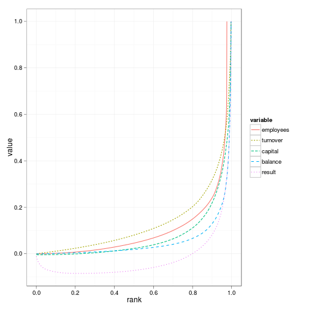
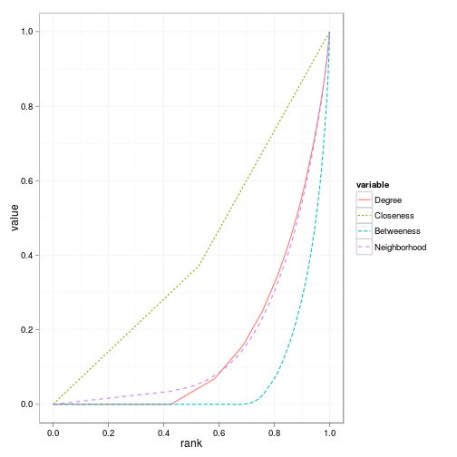

En simpel introduktion til de 1000 største virksomheder i Danmark
========================================================

I det her dokument samles tabeller og figurer til analysen af corporate interlocks i Danmark


```
## Loading required package: plyr
```

```
## Attaching package: 'reshape'
```

```
## The following object(s) are masked from 'package:plyr':
## 
## rename, round_any
```

```
## Warning: 'memory.size()' is Windows-specific
```

```
## [1] Inf
```


Pareto fordelinger eller Lorentz-kurver for økonomiske variable og netværksvariable.


```
Warning: Removed 204 rows containing missing values (geom_path).
```

  


## Deskriptiv statistik for netværksmål

Her beskrives data udfra branche. Det er klart at målene i network.by.variable ikke er de rigtige. Der skal laves en funktion specifikt til denne analyse.

Her skal vi have:


```
                                All 1. Quantile: Smallest 2. Quantile 3. Quantile 4. Quantile: Largest
Corporations                 1037.0                 673.0       669.0       671.0                671.0
Ties                         2724.0                1170.0      1104.0      1110.0               1122.0
% in central component         49.5                   9.5         9.1         9.7                  8.3
Average degree                  5.3                   1.1         0.9         0.9                  1.0
Average betweeness            952.8                 158.5       172.0       164.2                190.0
Average 3rd neighborhoodsize   53.9                  11.3         9.2        10.1                  9.7
```


 

```
Error: replacement has 527 rows, data has 1037
```


## Deskriptiv statistik for inderkredsen - broer og den slags
Her skal vi have en matrice der siger hvor stor en komponent er alt efter om den er bundet sammen af alle, af CEO, direktion og bestyrelsesformænd


```
Error: object 'net.inderkreds' not found
```

```
Error: object 'navne' not found
```

```
Error: object 'navne' not found
```

```
Error: object 'rel.i' not found
```

```
Error: object 'post' not found
```

```
Error: object 'rel.i' not found
```

```
Error: object 'rel.d' not found
```

```
Error: object 'navn.d' not found
```

```
Error: object 'navn.d' not found
```

```
Error: object 'navne' not found
```

```
Error: object 'direktør' not found
```

